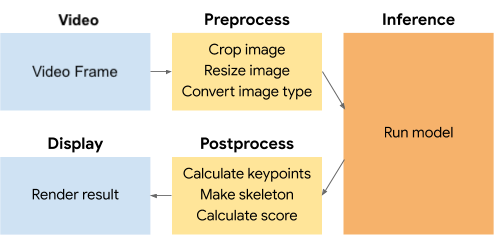

# Tensorflow Lite PoseNet iOS Example Application with Videos


## Overview
This app continuously detects the key points of a
person in real-time with the video selected from the photo library using the
[Pose Estimation model][posenet-model]. Key point of a person means a point
needed to build a skeleton of the person, such as shoulders, elbows, knees, etc.

Application extracts the image with the same aspect ratio to model input
size (257X257). You can find the extracted area in the display. The result is rendered when the total inference score is higher than
`0.5`.

Video frames are discarded immediately after use, nothing is stored or saved.

### Model used
[Pose Estimation model][posenet-model] is a vision model that can be used to
estimate the pose of a person in an image or video by estimating where key body
joints are.

### Structure





#### Preprocessing
While preprocessing, it converts video input image to satisfy the model input
specification. It crops the original image to have the same aspect ratio as the
model input size. After that it resizes the cropped image to the model input
size, and converts it to the required data type.

#### Inference
Assign preprocessed data to the input tensor and run [the model][posenet-model].
Output data is assigned to the output tensors as a result.

#### Postprocessing
In postprocessing, it calculates the positions of the key points and the lines
to display, along with the total confidence score. Total confidence score is the
average of all the key points' confidence scores. Coordinates of the key points
are calculated from the heat and the offset tensors. These coordinates are based
on the model input size, which implies that you should transform each coordinate
to match the video frame size of key points. As the video frame size of this
application is different from model input size, it transforms the points. With
the transformed dots, the skeleton of a person can be drawn by connecting the
dots between adjacent joints.


## Requirements

* Xcode
* Valid Apple Developer ID
* Real iOS device with camera
* iOS version 12.0 or above
* Xcode command line tools (to install, run `xcode-select --install`)
* CocoaPods (to install, run `sudo gem install cocoapods`)

## Build and run
1. Clone the TensorFlow examples GitHub repository to your computer to get the
demo application.

    ```
    git clone https://github.com/tensorflow/examples
    ```

1. Install the pod to generate the workspace file:

    ```
    cd examples/lite/examples/posenet/ios && pod install
    ```
    Note: If you have installed this pod before and that command doesn't work,
    try `pod update`.
    At the end of this step you should have a directory called
    `PoseNet.xcworkspace`.

1. Open the project in Xcode with the following command:

    ```
    open PoseNet.xcworkspace
    ```
    This launches Xcode and opens the `PoseNet` project.

1. In Menu bar, select `Product` &rarr; `Destination` and choose your physical
device.
1. In Menu bar, select `Product` &rarr; `Run` to install the app on your device.

[posenet-model]: https://www.tensorflow.org/lite/models/pose_estimation/overview
